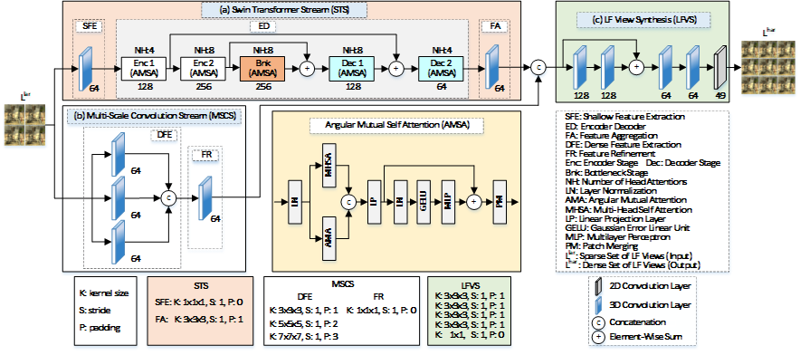

# SWINSCALE-LFVS: PARALLEL FEATURE INTEGRATION FOR LIGHT FIELD VIEW SYNTHESIS

**Abstract** 
Light Field (LF) view synthesis aims to synthesize a dense set of LF views from a sparse set of input views. Although many recent learning-based methods have shown promising results in this task, they often rely on deep residual networks or on multiple LF representations to extract dense features, without fully exploiting the geometric structure of the LFs. In this paper, we introduce SwinScale-LFVS, a novel framework that combines the strengths of the Swin Transformer and the Multi-Scale Convolutional Network in parallel streams. The first stream uses a Swin Transformer to model local and global features using a geometry-aware Angular Mutual Self Attention (AMSA) network, and the second stream uses multi-scale 3D convolutions to extract dense features and to ensure spatial-angular consistency in synthesized LF views. The outputs from these streams are integrated and processed by an LF View Synthesis (LFVS) network to synthesize high-quality dense LF views. Extensive experiments show that SwinScale-LFVS outperforms existing methods on both real-world and synthetic datasets. 

  
   
  <b>Fig. 1.</b> <i>SwinScale-LFVS modules: (a) Swin-Transformer Stream, (b) Multi-Scale Convolution Stream, and (c) LF View Synthesis..</i>

### 📊 Table I. Quantitative Comparison on Synthetic Datasets (PSNR / SSIM)

| Dataset   | LFASR-GEO [9]  | GA-MRVR [10]  | Deformable-LFVS [11] | LF-EASR [12]  | Distg-ASR [13]  | <b>SwinScale-LFVS</b>   |
|-----------|----------------|----------------|------------------------|----------------|------------------|--------------------------|
| HCI-new   | 32.29 / 0.911  | 34.28 / 0.936  | 34.52 / 0.936         | 34.27 / 0.949  | 34.16 / 0.969    | <b>35.75 / 0.972</b>     |
| HCI-old   | 35.73 / 0.937  | 40.82 / 0.953  | 41.25 / 0.958         | 41.47 / 0.970  | <b>42.13 </b>/ 0.974 | 41.97 /<b> 0.975 </b>        |
| <b>Average</b> | 34.01 / 0.924  | 37.55 / 0.945  | 37.89 / 0.955         | 37.87 / 0.960  | 38.14 / 0.972    | <b>38.86 / 0.974</b>     |

### 📊 Table II. Quantitative Comparison on Real-World Datasets (PSNR / SSIM)

| Dataset     | LFASR-GEO [9]  | GA-MRVR [10]  | Deformable-LFVS [11] | LF-EASR [12]  | Distg-ASR [13]  | <b>SwinScale-LFVS</b>   |
|-------------|----------------|----------------|------------------------|----------------|------------------|--------------------------|
| UCSD        | 40.78 / 0.982  | 42.91 / 0.987  | 43.19 / 0.987         | 43.15 / 0.980  | 43.60 / 0.986    | <b>43.87 / 0.987</b>     |
| Occlusions  | 36.43 / 0.971  | 39.04 / 0.981  | 39.45 / <b>0.984</b>         | 39.18 / 0.979  | 39.40 / 0.982    | <b>39.85</b>  / 0.983    |
| Reflective  | 36.25 / 0.945  | 39.04 / 0.962  | 39.19 /<b> 0.963</b>         | 38.91 / 0.958  | 39.02 / 0.960    | <b>39.45</b>/ 0.962     |
| <b>Average</b> | 37.82 / 0.966  | 40.33 / 0.976  | 40.61 /<b> 0.978</b>         | 40.41 / 0.972  | 40.67 / 0.976    | <b>41.06</b> / <u>0.977</u>     |
